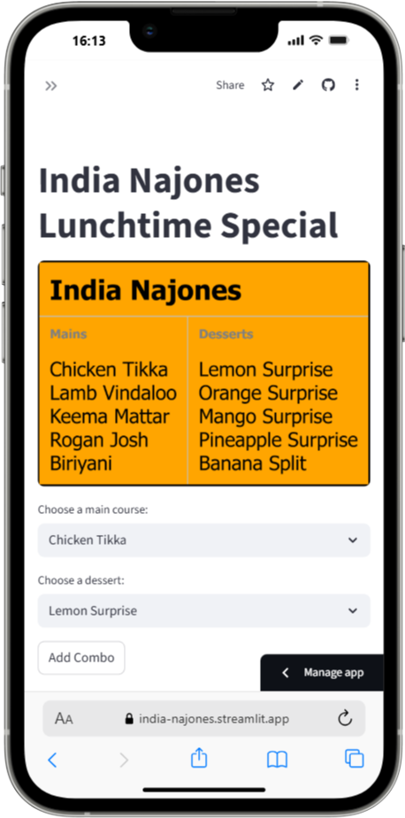

# India Najones Lunchtime Special

### Purpose:
This app helps students understand combinations in a fun and interactive way. By choosing one main course and one dessert, students explore how many unique meal combos can be created. The app tracks their selections and celebrates when all combinations are chosen.

[](https://india-najones.streamlit.app/)



### Key Features:
- **Combination Exploration**: Choose from 3 main courses and 2 desserts to create unique meal combos.
- **Progress Tracker**: The app keeps a record of selected combos, ensuring no combo is repeated.
- **Completion Celebration**: Once all possible combos are selected, the app shows a fun success message and balloons.

### Based On:
This app is based on a combinatorics activity from [Transum.org](https://www.transum.org/), where students are asked to determine how many different meal combinations are possible from a menu with 3 main courses and 2 desserts.

### Educator Notes:
- **Learning Objective**: Introduce students to the concept of combinations and help them calculate the total number of possible outcomes.

---

### How to run it on your own machine

1. Install the requirements

   ```
   $ pip install -r requirements.txt
   ```

2. Run the app

   ```
   $ streamlit run streamlit_app.py
   ```
